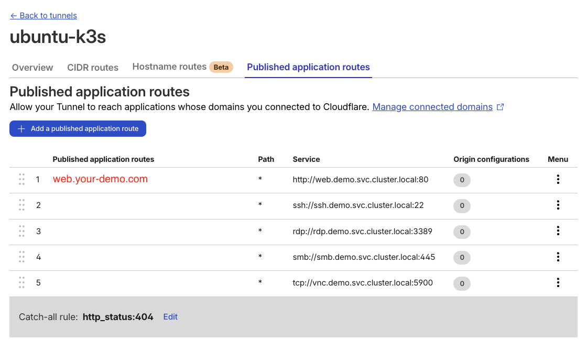
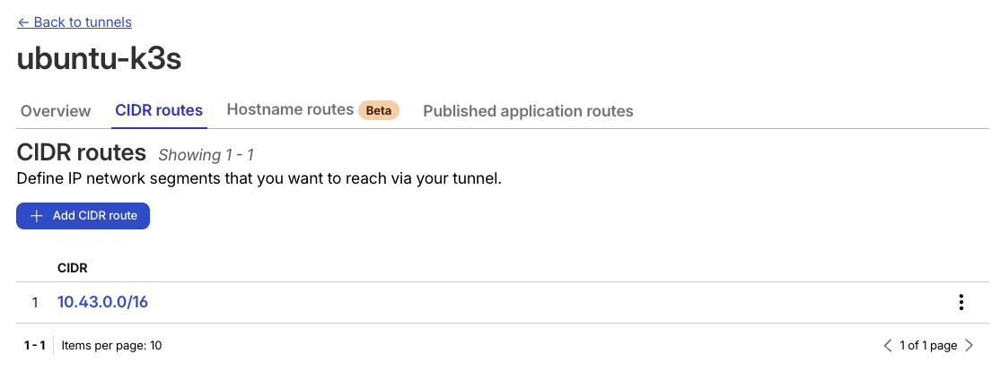
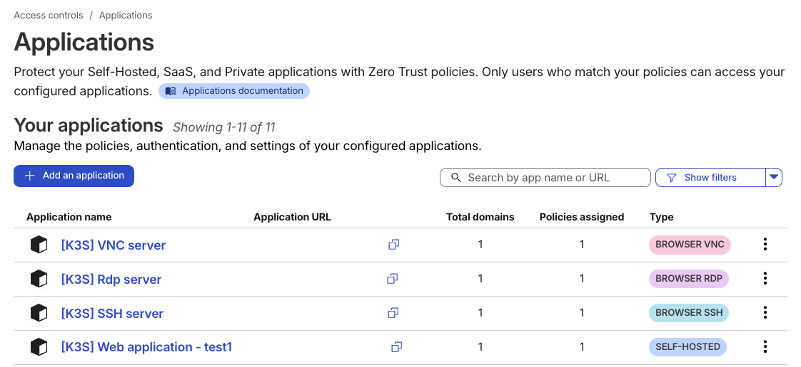

# Zero Trust Demo Environment
- Cloudflare Zero Trust 데모 환경

## 아키텍처

```
Client VM (macOS UTM + WARP)
        │
        │ WARP Tunnel
        │
Cloudflare Edge
        │
        │ Cloudflare Tunnel (Token-based)
        │
┌─── Kubernetes Cluster (k3s) ───┐
│                                │
│  cloudflared (tunnel connector)│
│       │                        │
│  ├── web  (nginx)              │
│  ├── ssh  (openssh-server)     │
│  ├── rdp  (rdesktop)           │
│  ├── smb  (samba)              │
│  └── vnc  (vnc-desktop)        │
│                                │
└────────────────────────────────┘
```

### 접근 방식

| 서비스 | 접근 방식 | 포트 |
|--------|-----------|------|
| HTTP   | Public Hostname (Clientless) | 80 |
| SSH    | WARP private network | 22 |
| RDP    | WARP private network | 3389 |
| SMB    | WARP private network | 445 |
| VNC    | WARP private network | 5900 |

<br>

---

## 환경 요구사항

### Server VM
- **OS**: Ubuntu Server 22.04 ARM
- **CPU**: 4 cores
- **RAM**: 6GB
- **Disk**: 40GB
- **역할**: k3s, Kubernetes workloads, cloudflared tunnel

### Client VM
- **OS**: macOS (UTM VM)
- **CPU**: 2 cores
- **RAM**: 4GB
- **Disk**: 30GB
- **역할**: Cloudflare WARP client, SSH/RDP/SMB 테스트


<br>

---

## 프로젝트 구조

```
zero-trust-demo/
├── README.md
├── .gitignore
├── scripts/
│   ├── install-k3s.sh       # k3s 설치 + kubectl alias 설정
│   └── deploy.sh            # Kustomize 기반 배포
└── k8s/
    ├── namespace.yaml       # demo 네임스페이스
    ├── web.yaml             # nginx (ClusterIP)
    ├── ssh.yaml             # openssh-server (ClusterIP: 10.43.0.22)
    ├── rdp.yaml             # rdesktop (ClusterIP: 10.43.0.39)
    ├── smb.yaml             # samba (ClusterIP: 10.43.0.45)
    ├── vnc.yaml             # vnc-desktop (ClusterIP: 10.43.0.59)
    ├── kustomization.yaml   # Kustomize 설정
    └── cloudflared/
        ├── secret.yaml.example  # Tunnel token 예제
        └── deployment.yaml      # cloudflared (replicas: 2)
```


<br>

---

## 네트워크 설계

### Service CIDR
```
10.43.0.0/16 (k3s default)
```

### 고정 Service IP

| 서비스 | ClusterIP  | 포트 | 용도 |
|--------|------------|------|------|
| SSH    | 10.43.0.22 | 22 | WARP private routing |
| RDP    | 10.43.0.39 | 3389 | WARP private routing |
| SMB    | 10.43.0.45 | 445 | WARP private routing |
| VNC    | 10.43.0.59 | 5900 | WARP private routing |

<br>

---

## 설치 가이드

### 1. Server VM 설정

k3s 설치:

```bash
cd ~/sase-demo-k3s
chmod +x scripts/install-k3s.sh
./scripts/install-k3s.sh
```

설치 후 `k` alias가 자동 설정됩니다:

```bash
k get nodes
k get pods -A
```

### 2. Cloudflare Tunnel 설정

Cloudflare Zero Trust Dashboard에서:

1. **Access → Tunnels → Create a tunnel**
2. Tunnel 이름: `demo-tunnel`
3. Connector: **Cloudflared**
4. **토큰 복사** (eyJhIjoiNWFiNGU5Z... 형태)

Secret 파일 생성:

```bash
cat > k8s/cloudflared/secret.yaml <<EOF
apiVersion: v1
kind: Secret
metadata:
  name: tunnel-token
  namespace: demo
type: Opaque
stringData:
  token: YOUR_TUNNEL_TOKEN_HERE
EOF
```

`YOUR_TUNNEL_TOKEN_HERE`를 실제 토큰으로 교체하세요.

### 3. 배포

```bash
cd ~/sase-demo-k3s
chmod +x scripts/deploy.sh
./scripts/deploy.sh
```

배포 확인:

```bash
k get pods -n demo
k get svc -n demo
```

예상 출력:
```
NAME                          READY   STATUS    RESTARTS   AGE
cloudflared-xxxxxxxxxx-xxxxx  1/1     Running   0          1m
cloudflared-xxxxxxxxxx-xxxxx  1/1     Running   0          1m
cloudflared-xxxxxxxxxx-xxxxx  1/1     Running   0          1m
web-xxxxxxxxxx-xxxxx          1/1     Running   0          1m
ssh-xxxxxxxxxx-xxxxx          1/1     Running   0          1m
rdp-xxxxxxxxxx-xxxxx          1/1     Running   0          1m
smb-xxxxxxxxxx-xxxxx          1/1     Running   0          1m
vnc-xxxxxxxxxx-xxxxx          1/1     Running   0          1m
```

### 4. Cloudflare Dashboard 설정

**Published application routes 추가:**
- Subdomain: `web`
- Domain: `your-demo.com`
- Service: `http://web.demo.svc.cluster.local:80`



** CIDR routes 추가 :**
- Tunnels → demo-tunnel → CIDR routes
- CIDR: `10.43.0.0/16`



### 5. Access Applications 설정 (Optional)
- 만일 터널에 등록한 경로에 대하여, 각각의 앱에 대한 접근을 따로 관리하고 싶은 경우 Access에 추가할 수 있습니다.



<br>

---

## Client VM 설정 (macOS)

### WARP 클라이언트 설치

1. [Cloudflare WARP for macOS](https://1.1.1.1/) 다운로드
2. 설치 후 실행
3. Settings → Preferences → Account → Login to Cloudflare Zero Trust
4. 조직 이름 입력: `YOUR_TEAM_NAME`
5. 브라우저에서 인증 완료

또는 CLI:

```bash
warp-cli register
warp-cli connect
warp-cli teams-enroll YOUR_TEAM_NAME
```

## 테스트

### HTTP (Public Hostname)

브라우저에서:
```
https://web-demo.example.com
```

### SSH (WARP Private Network)

macOS Terminal:

```bash
ssh demo@10.43.0.22
```

- **Username**: `demo`
- **Password**: `demo`

### RDP (WARP Private Network)

macOS Microsoft Remote Desktop:

1. App Store에서 "Microsoft Remote Desktop" 설치
2. Add PC
3. PC name: `10.43.0.39`
4. User account: Add User Account
   - Username: `abc`
   - Password: `abc`
5. Connect

### SMB (WARP Private Network)

macOS Finder:

1. Finder → Go → Connect to Server (⌘K)
2. Server Address: `smb://10.43.0.45`
3. Connect
4. Credentials:
   - Username: `demo`
   - Password: `demo`

### VNC (WARP Private Network)

macOS Screen Sharing 또는 VNC Viewer:

1. Finder → Go → Connect to Server (⌘K)
2. Server Address: `vnc://10.43.0.59:5900`
3. Credentials:
   - **Username**: `demo`
   - **Password**: `ubuntu`

## 트러블슈팅

Pod 상태 확인:

```bash
k describe pod <pod-name> -n demo
k logs <pod-name> -n demo
```

cloudflared 로그 확인:

```bash
k logs -l app=cloudflared -n demo --tail=50
```

WARP 상태 확인:

```bash
warp-cli status
```

## 정리

리소스 삭제:

```bash
k delete namespace demo
```

k3s 제거:

```bash
/usr/local/bin/k3s-uninstall.sh
```
